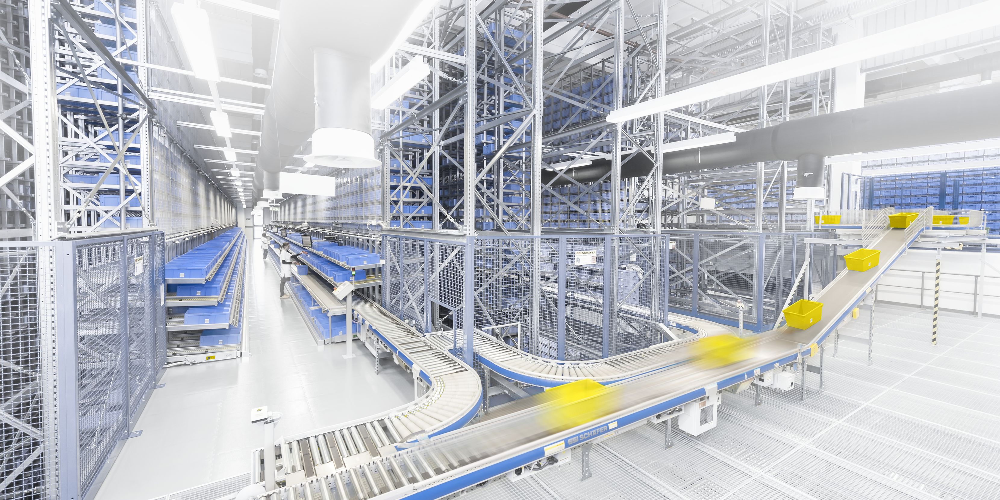

# Conveying-Transport System Simulation for Parcel Redistribution

This repository provides a simulation of a conveying-transport system designed for logistics businesses, inspired by systems like those at [SSI Schaefer](https://www.ssi-schaefer.com/en-au/products/conveying-transport).



## Overview

The simulation demonstrates the flow and redistribution of parcels within a logistics environment, utilizing SimPy for process-based discrete-event simulation. This project aims to model the efficiency and dynamics of a conveying-transport system.

## Features

- **Simulation of Parcel Flow**: Models the movement and handling of parcels through a conveying system.
- **Control and Monitoring**: Includes modules for controlling and monitoring the simulation.
- **Database Operations**: Functions to handle data storage and retrieval.
- **Machine Logic**: Classes that simulate the behavior of factory machines.
- **Vehicle Descriptions**: Models for different types of vehicles used in the system.

## Repository Structure

- `data`: Contains demo data for running simulations.
- `demo`: Includes a PoC demo
- `docs`: Development documentation, process diagrams, and class explanations.
- `logs`: Stores log files generated during simulations.
- `src`: 
  - `controllers`: Modules for control and monitoring of the simulation.
  - `db`: Functions related to database operations.
  - `machine`: Python classes that simulate factory machine logic.
  - `utils`: Helper functions for various tasks.
  - `vehicles`: Python classes that describe different vehicles.

## Getting Started

### Prerequisites

- Python 3.x
- SimPy library

### Installation

1. Clone the repository:
   ```bash
   git clone https://github.com/yourusername/conveying-transport-simulation.git
   ```
2. Navigate to the project directory:
   ```bash
   cd conveying-transport-simulation
   ```
3. Install the required Python packages:
   ```bash
   pip install -r requirements.txt
   ```

### Running the Simulation

1. Navigate to the `src` directory:
   ```bash
   cd src
   ```
2. Run the main simulation script:
   ```bash
   python main.py
   ```

## Contributing

Contributions are welcome! Please fork the repository and submit a pull request for any improvements or bug fixes.

## License

This project is licensed under the MIT License - see the [LICENSE](LICENSE) file for details.

## Contact

For questions or feedback, please contact [zp4work+dev@gmail.com](mailto:zp4work+dev@gmail.com).
